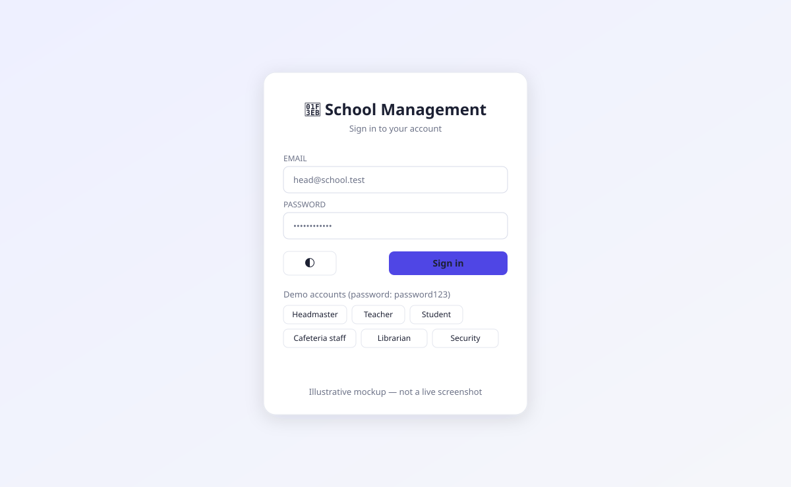
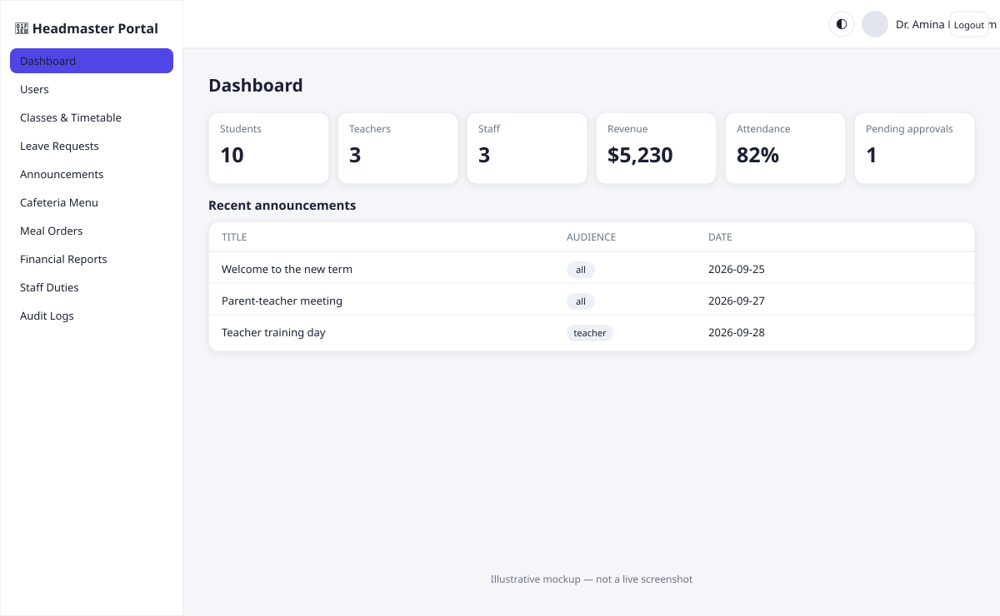
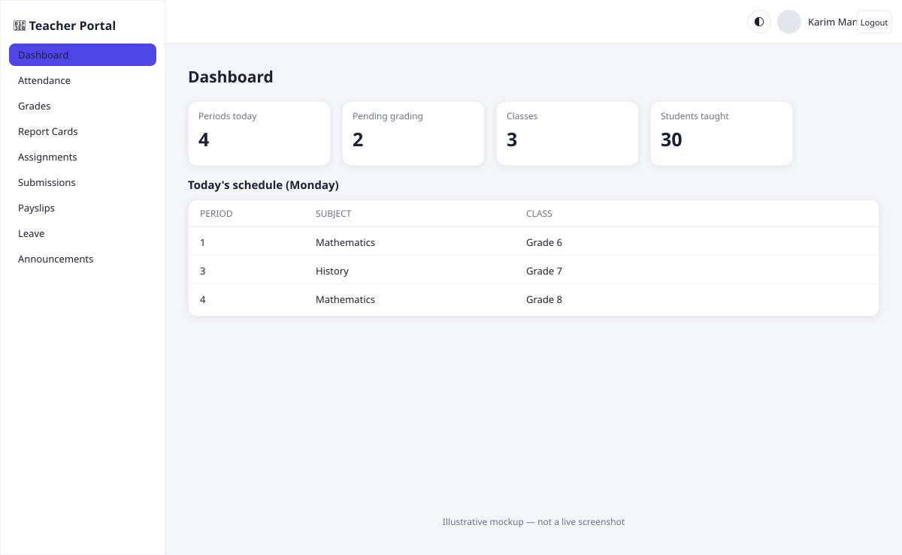
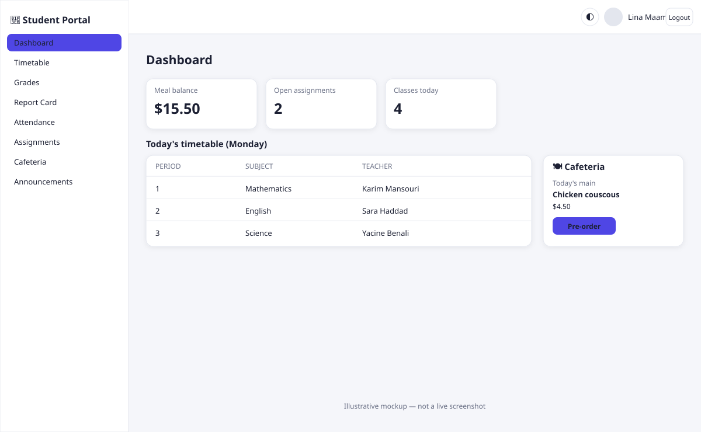
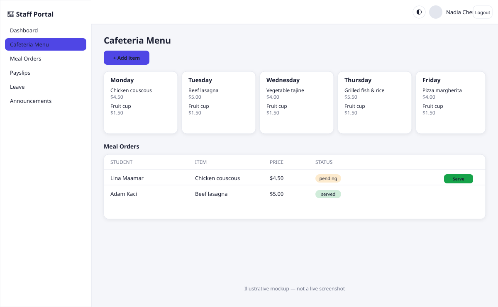

<div align="center">


<br/>


<br/><br/>

<a href="#-live-demo"><b>Live Demo</b></a> •
<a href="#-screenshots"><b>Screenshots</b></a> •
<a href="#-features"><b>Features</b></a> •
<a href="#-tech-stack"><b>Tech Stack</b></a> •
<a href="#-api-reference"><b>API</b></a> •
<a href="#-getting-started"><b>Setup</b></a> •
<a href="#-roles--access"><b>Roles</b></a>

</div>

<br/>

<div align="center">
<table>
<tr>
<td align="center" width="25%">🧑‍💼<br/><b>Headmaster</b><br/><sub>Full system control</sub></td>
<td align="center" width="25%">🧑‍🏫<br/><b>Teacher</b><br/><sub>Classes &amp; grading</sub></td>
<td align="center" width="25%">🎓<br/><b>Student</b><br/><sub>Learning &amp; cafeteria</sub></td>
<td align="center" width="25%">🧑‍🔧<br/><b>Staff</b><br/><sub>Duties &amp; payroll</sub></td>
</tr>
</table>
</div>

<br/>

## 📖 About

**School Management System** is a full-stack, role-based web application built to run the daily operations of a school — from attendance and grading to leave requests, announcements, payroll, and a complete **cafeteria ordering module** with student meal wallets.

Four distinct roles — **Headmaster**, **Teacher**, **Student**, and **Staff** (Accountant / Librarian / Janitor / Security / Cafeteria Worker) — each get a purpose-built dashboard, navigation, and permission set, all backed by a single hardened REST API and a PostgreSQL database.

<br/>

## 🌐 Live Demo

<div align="center">

<table>
<tr><th>🔗 URL</th><td><code>https://school-management-u1qp.hatchable.site</code></td></tr>
<tr><th>🔑 Password</th><td><code>password123</code> (all accounts)</td></tr>
</table>

| Role | Login |
|---|---|
| 👑 Headmaster | `head@school.test` |
| 🧑‍🏫 Teachers | `t1@school.test` → `t3@school.test` |
| 🎓 Students | `s1@school.test` → `s10@school.test` |
| 🍽️ Cafeteria Staff | `cafe@school.test` |
| 📚 Librarian | `library@school.test` |
| 🛡️ Security | `security@school.test` |

</div>

<br/>

## 📸 Screenshots

> ⚠️ **These are illustrative mockups, not live screenshots.** I don't have a browser tool to capture the deployed app, so these are hand-built SVGs styled to match the real UI (same layout, sidebar, cards and colors). Swap them for real screenshots whenever you get a chance — see the note at the end of this section.

<div align="center">

<table>
<tr>
<td align="center" width="50%"><b>Login</b><br/></td>
<td align="center" width="50%"><b>Headmaster Dashboard</b><br/></td>
</tr>
<tr>
<td align="center" width="50%"><b>Teacher Dashboard</b><br/></td>
<td align="center" width="50%"><b>Student Dashboard</b><br/></td>
</tr>
<tr>
<td align="center" colspan="2"><b>Cafeteria Module</b><br/></td>
</tr>
</table>

</div>

<details>
<summary><b>🔁 Replacing these with real screenshots</b></summary>

<br/>

1. Open the [live demo](#-live-demo) and sign in with a demo account.
2. Capture each screen (browser devtools → full-page screenshot, or any screenshot tool).
3. Save them into a `screenshots/` folder at the repo root, e.g. `screenshots/headmaster-dashboard.png`.
4. Update the `` paths above to point at your `.png` files instead of the `.svg` mockups.

</details>

<br/>

## ✨ Features

<table>
<tr>
<td valign="top" width="50%">

### 👑 Headmaster
- 📊 Live dashboard — students, teachers, staff, revenue, attendance %, pending approvals
- 👥 Full CRUD on every user (teachers, students, staff)
- 🏫 Manage classes, sections, subjects &amp; timetables
- ✅ Approve / reject leave requests
- 💰 Financial reports — fees, salaries, expenses
- 📢 Post school-wide announcements
- 🍽️ Manage cafeteria menu &amp; pricing
- 📜 View full audit log

</td>
<td valign="top" width="50%">

### 🧑‍🏫 Teacher
- 📅 Today's schedule &amp; class list at a glance
- ✅ Mark daily / per-period attendance
- 📝 Enter grades &amp; generate report cards
- 📚 Create &amp; grade homework assignments
- 💵 View payslip history
- 🏖️ Apply for leave
- 📢 View school announcements

</td>
</tr>
<tr>
<td valign="top" width="50%">

### 🎓 Student
- 🗓️ Personal timetable &amp; upcoming assignments
- 📈 Grades &amp; printable report cards
- ✅ Attendance record
- 📤 Submit homework (file upload)
- 🍔 Weekly cafeteria menu, pre-order meals
- 💳 Meal wallet — balance &amp; top-up
- 📢 View announcements

</td>
<td valign="top" width="50%">

### 🧑‍🔧 Staff
*(Accountant · Librarian · Janitor · Security · Cafeteria)*
- 🗂️ Role-specific duties &amp; schedule
- 🔄 Update assigned task status
- 💵 Payslip history
- 🏖️ Apply for leave
- 📢 View announcements
- 🍽️ Cafeteria staff also manage the menu &amp; orders

</td>
</tr>
</table>

<br/>

## 🛠️ Tech Stack

<div align="center">

| Layer | Technology |
|---|---|
| **Frontend** | Single-page vanilla JS app · responsive CSS · dark mode |
| **Backend** | Serverless REST API (catch-all route handler) |
| **Database** | PostgreSQL, accessed via parameterized raw SQL |
| **Auth** | PBKDF2 password hashing + HMAC-signed JWT sessions (cookie + Bearer) |
| **File Storage** | Platform object storage for avatars &amp; homework uploads |
| **Hosting** | [Hatchable](https://hatchable.com) |

</div>

<br/>

## 🏗️ Architecture

```text
┌──────────────────────┐        ┌────────────────────────────┐        ┌──────────────────┐
│   SPA (index.html)   │ ─────▶ │   /api/[...path].js         │ ─────▶ │   PostgreSQL DB   │
│  role-based sidebar  │  REST  │   auth · routing · guards    │  SQL   │  schema + seed    │
│  tables · forms      │ ◀───── │   lib/routes_a.js            │ ◀───── │  on first request  │
│  toasts · dark mode  │  JSON  │   lib/routes_b.js             │        └──────────────────┘
└──────────────────────┘        │   lib/core.js (auth/schema)  │
                                 └────────────────────────────┘
                                             │
                                             ▼
                                   ┌───────────────────┐
                                   │   Object Storage    │
                                   │  avatars · uploads   │
                                   └───────────────────┘
```

<br/>

## 📂 Project Structure

```text
school-management-system/
├── api/
│   └── [...path].js        # Catch-all API router — auth, dispatch, guards
├── lib/
│   ├── core.js              # Password hashing, JWT sign/verify, schema + seed
│   ├── routes_a.js          # Dashboard, users, classes, timetable, attendance, grades
│   └── routes_b.js          # Assignments, leave, announcements, cafeteria, payroll
└── public/
    └── index.html            # Full SPA frontend — all 4 role UIs in one file
```

<br/>

## 🔐 Roles &amp; Access

<div align="center">

| Capability | Headmaster | Teacher | Student | Staff |
|---|:---:|:---:|:---:|:---:|
| Manage users | ✅ | ❌ | ❌ | ❌ |
| Manage classes / timetable | ✅ | 👁️ | 👁️ | ❌ |
| Mark attendance | ✅ | ✅ | 👁️ own | ❌ |
| Enter grades | ✅ | ✅ | 👁️ own | ❌ |
| Create assignments | ✅ | ✅ | ❌ | ❌ |
| Submit homework | ❌ | ❌ | ✅ | ❌ |
| Approve leave | ✅ | ❌ | ❌ | ❌ |
| Apply for leave | ❌ | ✅ | ❌ | ✅ |
| Post announcements | ✅ | 👁️ | 👁️ | 👁️ |
| Manage cafeteria menu | ✅ | ❌ | ❌ | ✅ *(cafeteria)* |
| Order / top-up meals | ❌ | ❌ | ✅ | ❌ |
| View financial reports | ✅ | ❌ | ❌ | ❌ |
| View audit logs | ✅ | ❌ | ❌ | ❌ |

</div>

<br/>

## 🧬 Database Schema

<details>
<summary><b>Click to expand entity overview</b></summary>

<br/>

```text
users ─┬─< students >── class_id ──> classes >── section_id ──> sections
       ├─< teachers
       ├─< staff
       ├─< leave_requests
       ├─< payslips
       └─< audit_logs

classes ─< timetable >── subjects
students ─< attendance
students ─< grades >── subjects
assignments ─< submissions >── students
menu_items ─< meal_orders >── students
students ─< transactions
```

**Core tables:** `users` · `students` · `teachers` · `staff` · `classes` · `sections` · `subjects` · `timetable` · `attendance` · `grades` · `assignments` · `submissions` · `leave_requests` · `announcements` · `payslips` · `menu_items` · `meal_orders` · `transactions` · `fees` · `expenses` · `duties` · `audit_logs`

</details>

<br/>

## 📡 API Reference

<details>
<summary><b>Click to expand full endpoint list</b></summary>

<br/>

| Method | Endpoint | Description |
|---|---|---|
| `POST` | `/api/login` | Authenticate, returns JWT + sets cookie |
| `POST` | `/api/logout` | Clear session |
| `GET` | `/api/me` | Current user profile |
| `GET` `POST` `PUT` `DELETE` | `/api/users` | Manage user accounts |
| `GET` `POST` | `/api/classes` · `/api/subjects` | Academic structure |
| `GET` `POST` | `/api/timetable` | Class schedules |
| `GET` `POST` | `/api/attendance` | Mark / view attendance |
| `GET` `POST` | `/api/grades` | Enter / view grades |
| `GET` | `/api/report` *(client-side)* | Generated report cards |
| `GET` `POST` | `/api/assignments` | Homework assignments |
| `GET` `POST` `PUT` | `/api/submissions` | Submit &amp; grade homework |
| `GET` `POST` | `/api/leave-requests` | Leave applications |
| `PUT` | `/api/leave-requests/:id/approve` | Approve / reject leave |
| `GET` `POST` | `/api/announcements` | School-wide notices |
| `GET` `POST` `PUT` `DELETE` | `/api/menu` | Cafeteria menu management |
| `GET` `POST` `PUT` | `/api/meal-orders` | Pre-order &amp; fulfil meals |
| `POST` | `/api/meal-topup` | Top up student wallet |
| `GET` | `/api/balance` | Student meal balance |
| `GET` | `/api/payslips` | Payroll history |
| `GET` `POST` | `/api/expenses` | Record school expenses |
| `GET` | `/api/reports` | Financial summary |
| `GET` | `/api/audit-logs` | System activity trail |
| `GET` `POST` `PUT` | `/api/duties` | Staff task management |
| `POST` | `/api/profile-pic` | Upload avatar |
| `POST` | `/api/submissions` | Upload homework file |

*All routes except `/login` require a valid session (cookie or `Authorization: Bearer`) and are gated by role.*

</details>

<br/>

## 🚀 Getting Started

```bash
# 1 — Clone the repository
git clone https://github.com/<your-username>/school-management-system.git
cd school-management-system

# 2 — Deploy to Hatchable (or adapt api/ and lib/ to your own Node/Postgres host)
#     The schema and demo data are created automatically on first request.

# 3 — Open the live URL and sign in with any demo account
#     Password for every seeded account: password123
```

> 💡 No manual migration step needed — `lib/core.js` creates all tables and seeds demo data (1 headmaster, 3 teachers, 10 students, 3 staff, 5 subjects, 3 classes, a full timetable, a 5-day cafeteria menu, and sample announcements/assignments) the first time the API is called.

<br/>

## 🖥️ UI Highlights

<div align="center">

| 📱 Responsive | 🌓 Dark Mode | 🔍 Search &amp; Filter | ✅ Validated Forms | 🔔 Toasts |
|:---:|:---:|:---:|:---:|:---:|
| Mobile + desktop | One-click toggle | Every data table | Inline error handling | Instant feedback |

</div>

<br/>

## 🗺️ Roadmap

- [ ] Per-period attendance granularity
- [ ] Dedicated fee-collection workflow
- [ ] Payroll run screen (beyond read-only payslips)
- [ ] PDF export for report cards
- [ ] Real payment gateway for meal top-ups
- [ ] Multi-section support per class

<br/>

## 🤝 Contributing

Contributions, issues, and feature requests are welcome!

1. Fork the project
2. Create your feature branch (`git checkout -b feature/amazing-feature`)
3. Commit your changes (`git commit -m 'Add amazing feature'`)
4. Push to the branch (`git push origin feature/amazing-feature`)
5. Open a Pull Request

<br/>

## 📄 License

Distributed under the **MIT License**. See `LICENSE` for more information.

<br/>

<div align="center">


**Built with ❤️ for better school management**

</div>
